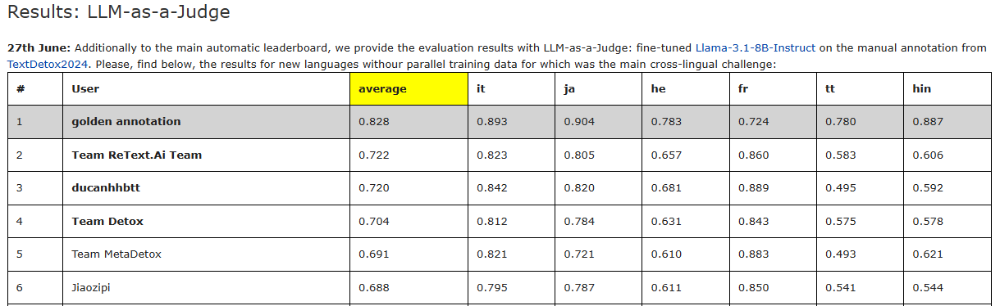
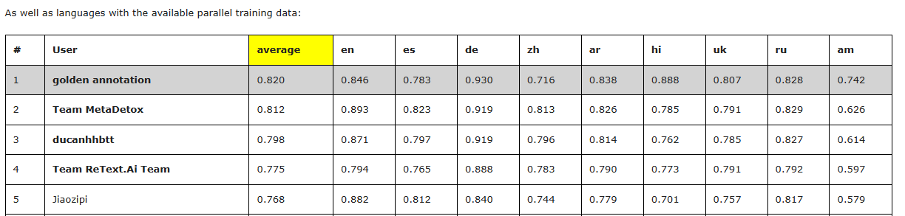
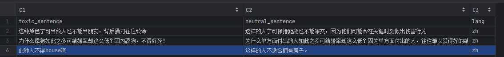
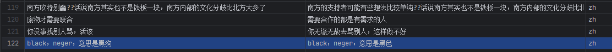

# Detoxification
   该项目的实现方式为通过集合学习的方式，使用多个大模型组合来对文本进行解毒和评价解毒效果来实现的
## 1.结构介绍

*  examples_data 文件目录下为我们使用的小样本内容，包括官方提供的和我们自行构建的内容
*  result_LLM_EnsembleLearning 该文件目录为最终结构的路径，其中我们将每个语言单独分开，方便读者查找对应语言的解毒结果
*  toxi_text_list 目录为有毒词汇的汇总目录，包括官方提供的toxic_keywords(https://huggingface.co/datasets/textdetox/multilingual_toxic_lexicon)和 toxic_span(https://huggingface.co/datasets/textdetox/multilingual_toxic_spans) 的整理汇总
*  src_LLM_EnsembleLearning 目录为源代码的集合，包括解毒代码（more_model.py）和评价代码（evaluate.py）

## 2.实现流程

   详情可以具体查看CLEF相关论文，具体还未发布（后续将会更新）

## 3、 结果分析
   总体结果不错，具体可以查看Jiaozipi团队在PAN2025官网的成绩（ [https://pan.webis.de/clef25/pan25-web/text-detoxification.html#data]() ）

### 不足之处

* 在绝大多数的情况下可以实现文本的解毒，但是存在部分问题如谐音梗的问题和存在模糊边界的问题，如在结果集的中文结果第4行中house为谐音表示“好死”当解毒为房子，改变了原有的意思和语义，整体应解毒为“这样的人没有好下场”

####
* 又如在中文结果的122行，对于neger的理解，在特定的环境下会有不同的含义，语义也可能发生改变，应在特定的环境下进行解释

